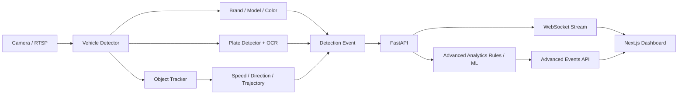

# Advanced Vehicle Intelligence Handoff

เอกสารนี้สรุปสิ่งที่ต้องทำต่อสำหรับฟีเจอร์:

- รุ่นรถ
- ป้ายทะเบียน
- ตรวจจับอุบัติเหตุ
- วิเคราะห์พฤติกรรมการขับขี่
- ตรวจจับเหตุการณ์ผิดปกติ เช่น ขับวน

## สถานะโค้ดปัจจุบัน

โปรเจกต์ตอนนี้ยังเป็น dashboard + FastAPI simulator ที่อ่านข้อมูลจาก `log.csv` แล้ว stream ผ่าน WebSocket:

- Backend entrypoint: `backend/main.py`
- Data source ปัจจุบัน: `log.csv`
- Frontend dashboard: `frontend/src/app/page.tsx`
- Type frontend: `frontend/src/types/index.ts`
- Chat summary/RAG: `backend/rag.py`

ข้อมูลเดิมมีแค่:

- `timestamp`
- `vehicleType`
- `brand`
- `colorLabel`
- `colorHex`

ดังนั้นฟีเจอร์ขั้นสูงยังทำงานจริงไม่ได้จนกว่าจะมี model/pipeline ที่ส่งข้อมูลเพิ่มเข้ามา เช่น plate OCR, tracking id, speed, direction, camera id, lane id, bounding box หรือ event confidence

## สิ่งที่เพิ่มไว้ให้แล้ว

เพิ่ม schema กลางสำหรับ detection/event:

- `backend/vision_schema.py`
- `frontend/src/types/index.ts`

เพิ่ม analytics rule engine ตั้งต้น:

- `backend/analytics.py`

เพิ่ม endpoint:

- `GET /api/advanced-events`

endpoint นี้จะคืน event จากข้อมูล enriched fields ถ้า CSV หรือ pipeline ส่ง field ใหม่เข้ามาแล้ว ถ้ายังมีแค่ข้อมูลเดิมจะคืน `events: []`

## Enriched Detection Schema

CSV หรือ detector pipeline ควรส่ง field เหล่านี้เพิ่ม:

| Field | Required | ใช้ทำอะไร |
|---|---:|---|
| `vehicleModel` | no | รุ่นรถ เช่น Civic, Hilux, Fortuner |
| `licensePlate` | no | ป้ายทะเบียนจาก OCR |
| `plateConfidence` | no | ความมั่นใจ OCR 0-1 |
| `cameraId` | no | กล้องที่ตรวจจับได้ |
| `laneId` | no | เลนที่รถอยู่ |
| `trackId` | no | ID จาก multi-object tracker |
| `frameId` | no | frame reference |
| `confidence` | no | ความมั่นใจของ detector |
| `bboxX`, `bboxY`, `bboxWidth`, `bboxHeight` | no | bounding box ของรถ |
| `speedKmh` | no | ความเร็วโดยประมาณ |
| `directionDeg` | no | ทิศทางการเคลื่อนที่ |
| `expectedDirectionDeg` | no | ทิศทางที่ถูกต้องของเลน |
| `locationX`, `locationY` | no | ตำแหน่งในพิกัดภาพ/map |

ตัวอย่าง CSV เพิ่ม field:

```csv
timestamp,vehicleType,brand,vehicleModel,licensePlate,plateConfidence,colorLabel,colorHex,cameraId,laneId,trackId,speedKmh,directionDeg,expectedDirectionDeg,bboxX,bboxY,bboxWidth,bboxHeight
2026-05-20T10:00:00Z,รถยนต์นั่งบุคคล,Honda,Civic,1กก1234,0.91,ขาว,#FFFFFF,CAM-01,L1,T-0001,52,90,90,430,210,120,80
```

## Feature Implementation Plan

### 1. รุ่นรถ

ต้องเพิ่ม vehicle make/model classifier หลังตรวจจับรถ:

- Input: cropped vehicle image จาก bounding box
- Output: `brand`, `vehicleModel`, `confidence`
- แนะนำให้แยก service เป็น `vehicle_attribute_service`
- UI: เพิ่ม filter/column `รุ่นรถ`
- API: ใช้ field `vehicleModel` ที่เตรียมไว้แล้ว

### 2. ป้ายทะเบียน

ต้องมี 2 ขั้น:

- License plate detector หา bounding box ป้าย
- OCR อ่านตัวอักษร

Output ที่ต้องส่ง:

- `licensePlate`
- `plateConfidence`
- optional plate bbox ถ้าต้องการ review UI

ข้อควรระวัง:

- อย่าแสดงป้ายทะเบียนเต็มให้ผู้ใช้ทั่วไป ถ้าเป็น production ควรมี role-based access หรือ masking เช่น `1กก****`
- เก็บ raw frame/plate crop ตาม retention policy

### 3. ตรวจจับอุบัติเหตุ

ทำได้ 2 ทางร่วมกัน:

- Vision event model ตรวจ crash/near-miss จากภาพหรือวิดีโอ
- Rule-based จาก tracking เช่น speed drop, stopped vehicle, object overlap, sudden direction change

โค้ดเริ่มต้นอยู่ใน `backend/analytics.py`:

- `accident_suspected`
- ใช้ `speedKmh`, `trackId`, timestamp

สิ่งที่ควรเพิ่มต่อ:

- collision/overlap จาก bbox ระหว่างรถหลายคัน
- stopped after impact
- camera-specific ROI เช่น จุดทางแยก/ทางกลับรถ
- severity scoring

### 4. วิเคราะห์พฤติกรรมการขับขี่

ต้องมี tracking และ trajectory:

- `trackId`
- `speedKmh`
- `directionDeg`
- `laneId`
- `locationX`, `locationY`

Event ที่ควรทำ:

- speeding
- sudden stop
- wrong-way
- lane weaving
- harsh acceleration/braking
- illegal U-turn
- unsafe following distance

ตอนนี้ `backend/analytics.py` มี rule ตั้งต้นสำหรับ:

- `speeding`
- `wrong_way`
- `stopped_vehicle`
- `accident_suspected`

### 5. เหตุการณ์ผิดปกติ เช่น ขับวน

ต้องใช้ identity ระหว่าง frame/camera:

- ดีสุด: `licensePlate`
- รองลงมา: `trackId` ในกล้องเดียว
- multi-camera ต้องมี camera topology

ตอนนี้ `backend/analytics.py` มี rule:

- `abnormal_looping`
- นับ vehicle key เดิมที่โผล่ซ้ำหลายครั้งใน window สั้น

สิ่งที่ควรเพิ่มต่อ:

- camera graph เช่น CAM-01 -> CAM-02 -> CAM-03 คือเส้นทางปกติ
- geofence/zone
- route history ต่อ license plate
- whitelist รถเจ้าหน้าที่หรือรถประจำทาง

## Suggested Architecture



## Files To Continue

Backend:

- `backend/vision_schema.py`: เพิ่ม field/schema ใหม่ตรงนี้ก่อน
- `backend/analytics.py`: เพิ่ม rule หรือเรียก ML anomaly model ตรงนี้
- `backend/main.py`: expose endpoint/WebSocket payload
- `backend/rag.py`: เพิ่ม intent ให้ chatbot ตอบเรื่องป้ายทะเบียน/อุบัติเหตุ/พฤติกรรมได้

Frontend:

- `frontend/src/types/index.ts`: type รองรับ field ใหม่แล้ว
- `frontend/src/components/DataTable.tsx`: เพิ่ม filter/column รุ่นรถ/ทะเบียน/event แล้ว ถ้ายังไม่มี metadata จะแสดงข้อความรอ metadata จริง
- `frontend/src/app/page.tsx`: เพิ่ม section สำหรับ alerts/behavior cards
- `frontend/src/components/AccidentAlert.tsx`: แจ้งเตือนเมื่อ `/api/advanced-events` มี event `accident_suspected`
- สร้าง component ใหม่ที่แนะนำ:
  - `AdvancedEventsPanel.tsx`
  - `LicensePlateTable.tsx`
  - `DrivingBehaviorSummary.tsx`

## API Contract

Frontend ตอนนี้อ่าน metadata/events จากสองทาง:

- realtime detections: `NEXT_PUBLIC_WS_URL` เช่น `ws://localhost:8000/ws/stream`
- advanced events: `NEXT_PUBLIC_API_URL` เช่น `http://localhost:8000`

ถ้าเปลี่ยนจาก `log.csv` simulator เป็น metadata จริง ให้เปลี่ยน backend ตรง `backend/main.py`:

- `load_csv()` สำหรับ history/stream payload เดิม
- `csv_streamer()` สำหรับ simulator stream
- `/ws/stream` ถ้าจะให้ real pipeline push detection เข้า WebSocket
- `/api/advanced-events` ถ้าจะให้ event มาจาก ML/event service จริงแทน rule-based

field ที่ frontend จะใช้ทันทีเมื่อ metadata จริงมา:

- filter รุ่นรถ: `vehicleModel`
- filter ป้ายทะเบียน: `licensePlate`
- filter เหตุการณ์: event `type` จาก `/api/advanced-events`
- alert อุบัติเหตุ: event `type = accident_suspected`

### `GET /api/advanced-events`

Response:

```json
{
  "events": [
    {
      "id": "speeding:T0001:2026-05-20T10:00:00Z",
      "type": "speeding",
      "timestamp": "2026-05-20T10:00:00Z",
      "severity": "medium",
      "title": "Speeding vehicle",
      "description": "Vehicle speed is 104 km/h, above 90 km/h.",
      "confidence": 0.74,
      "evidence": { "speedKmh": 104, "limitKmh": 90 },
      "detection": {}
    }
  ],
  "count": 1
}
```

## Definition Of Done

ก่อนส่งให้ใช้งานจริง ควรมี:

- sample video หรือ RTSP stream อย่างน้อย 2-3 มุมกล้อง
- ground truth สำหรับ plate/model/accident/anomaly
- confidence threshold แยกต่อกล้อง
- UI review flow สำหรับ event ที่ confidence ต่ำ
- masking หรือ permission สำหรับป้ายทะเบียน
- tests สำหรับ `analytics.py`
- dashboard state สำหรับ realtime event stream
- logging ว่า event เกิดจาก rule/model ไหน

## Notes For Next Developer

อย่าเริ่มจาก UI ก่อนถ้ายังไม่มี enriched data เพราะจะกลายเป็นข้อมูลหลอก ควรเริ่มจากการทำ detection payload ให้ครบ แล้วให้ dashboard render field ที่มีจริง

ถ้าต้อง demo เร็ว ให้ทำ sample CSV enriched data ก่อน แล้วใช้ endpoint `/api/advanced-events` ทดสอบ rule-based events ได้ทันที
